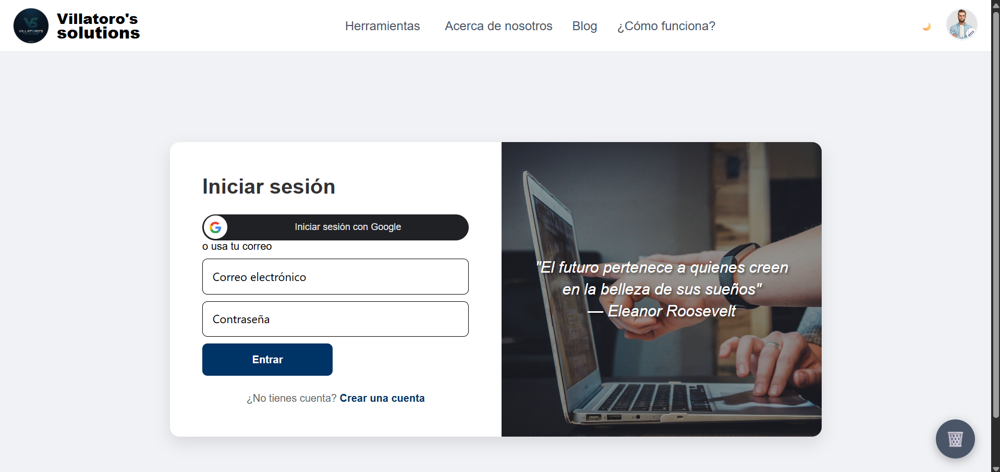
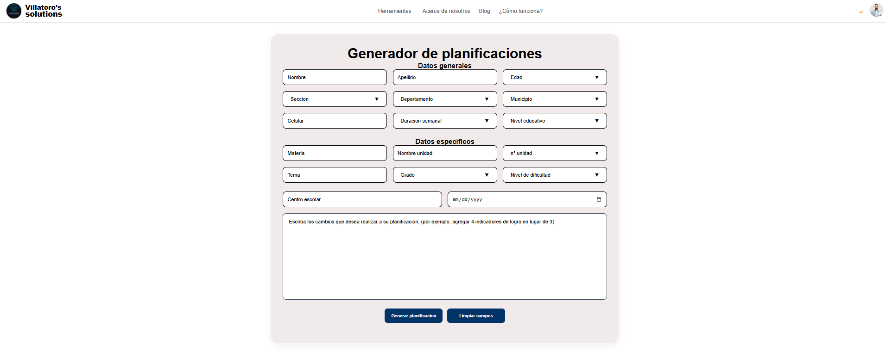
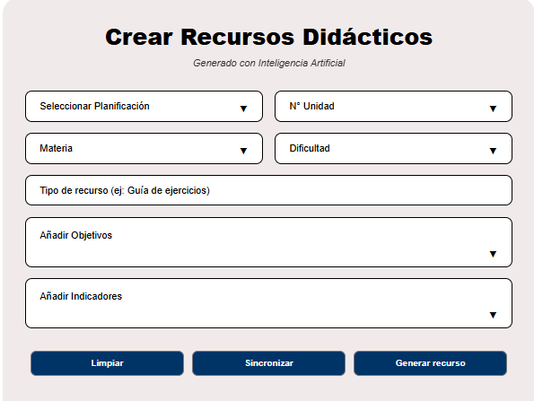
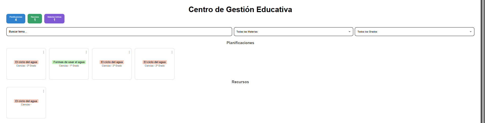

# Sistema Pedagógico Generador de Planificaciones

## Manual de Usuario

### Introducción
Bienvenido al **Sistema Pedagógico Generador de Planificaciones**, una herramienta web diseñada para docentes en El Salvador. Este sistema utiliza Inteligencia Artificial (IA) integrada para crear planificaciones educativas, recursos didácticos y materiales complementarios, todo alineado con el currículo del Ministerio de Educación (MINED). El objetivo es optimizar tu tiempo, reducir la carga administrativa y asegurar clases de calidad con estándares pedagógicos humanistas, constructivistas y socialmente comprometidos.

- **¿Qué resuelve?** Ayuda a generar planificaciones rápidas adaptadas al currículo salvadoreño, incluyendo indicadores de logro, objetivos, ejes y secuencias didácticas. También crea recursos como cuestionarios y fichas, con ajuste de dificultad (refuerzo o ampliación).
- **Público objetivo:** Docentes de parvularia, primer ciclo, segundo ciclo y tercer ciclo.
- **Beneficios:** Ahorra tiempo en planificación (generación en <10 segundos), exporta en PDF/DOCX, y es responsivo para móvil y PC.

### Requisitos del Sistema
- **Navegador:** Chrome, Firefox o Edge (versión actualizada).
- **Conexión:** Internet estable (para IA y DB).
- **Dispositivo:** Compatible con computadoras, tabletas y teléfonos móviles (diseño responsivo).
- **Accesibilidad:** Cumple con WCAG AA (contraste alto, navegación por teclado, lectores de pantalla). Si tienes dificultades visuales, usa modo de alto contraste en tu navegador.

### Instalación (Para Desarrolladores o Pruebas Locales)
Si quieres probar o contribuir al proyecto:
1. Clona el repositorio: `git clone https://github.com/vanessavillatoro/sistema-planificaciones-educativas.git`.
2. Ve a la carpeta `frontend`: Ejecuta `npm install` y luego `npm start` (abre en http://localhost:3000).
3. Ve a la carpeta `backend`: Ejecuta `npm install` y luego `node server.js` (servidor en http://localhost:5000).
4. Configura variables: Crea un archivo `.env` con `GEMINI_KEY=tu_clave` y `MONGO_URI=tu_uri_mongodb`.
5. Accede al sistema: Regístrate o inicia sesión.

**Nota:** Para uso en producción, el sistema está desplegado en Vercel (ver sección de despliegue).

### Uso Básico del Sistema
Sigue estos pasos para usar el sistema. Todo es intuitivo y guiado por formularios.

#### 1. Inicio de Sesión
- Ve a la página principal (en desarrollo: http://localhost:3000; en producción: URL de Vercel).
- Ingresa tu usuario y contraseña (si no tienes cuenta, regístrate con email y factor de seguridad opcional).
- Una vez dentro, verás el navbar con opciones: Módulos, Blog, Acerca de, etc.

  
*Captura: Pantalla de inicio de sesión con campos de usuario y contraseña.*

#### 2. Módulo 1: Generador de Planificaciones
- Selecciona "Generador de Planificaciones" en el menú.
- Llena los campos obligatorios:
  - Datos generales: Nombre, apellido, edad, sección, departamento, municipio, celular, duración semanal, nivel educativo.
  - Datos específicos: Materia, nombre unidad, nº unidad, tema, grado, nivel de dificultad.
  - Sugerencias: Escribe instrucciones personalizadas (e.g., "Genera 5 indicadores de logro" o "Cambia objetivos a temas locales de El Salvador").
- Haz clic en "Generar Planificación". La IA creará una planificación completa en <10 segundos, incluyendo indicadores de logro, objetivos, materiales, tiempos de clase y actividades complementarias.
- Si quieres editar: Escribe nuevas sugerencias (e.g., "cambiar materiales") y genera de nuevo (la IA preserva el resto).
- Guarda automáticamente o ve al Módulo 3 para gestionar.

  
*Captura: Formulario de generación con campos y botón "Generar".*

  
*Captura: Tabla con planificación generada, incluyendo momentos de clase.*

#### 3. Módulo 2: Generador de Recursos
- Selecciona "Generador de Recursos" en el menú.
- Ingresa descripción del recurso (e.g., "Cuestionario sobre fotosíntesis") y selecciona dificultad (refuerzo o ampliación).
- Haz clic en "Generar Recurso". La IA crea fichas, cuestionarios o lecturas con claves de respuestas.
- Guarda o ve al Módulo 3.

  
*Captura: Pantalla de generación de recursos con descripción y dificultad.*

#### 4. Módulo 3: Gestión de Planificaciones y Recursos
- Selecciona "Gestión" en el menú.
- Ve la lista de planificaciones y recursos guardados (filtra por fecha o categoría).
- Opciones: Editar (abre formulario con datos previos), Exportar (PDF o DOCX, descarga directa), Eliminar.
- Usa para revisar o compartir.

  
*Captura: Lista de planificaciones con botones de editar y exportar.*

#### 5. Otras Secciones
- **Blog:** Lee artículos sobre planificación educativa o tips para docentes.
- **Acerca de Nosotros:** Info del equipo y misión del proyecto.
- **Cómo Funciona:** Tutorial interactivo con diagramas de IA y módulos.
- **Navbar:** Haz clic en tu foto para menú desplegable (perfil, configuración, cerrar sesión).

  
*Captura: Navbar con menú desplegable para navegación.*

### Troubleshooting (Solución de Problemas)
- **La IA tarda más de 10 segundos:** Recarga la página o verifica tu conexión. Si persiste, contacta soporte.
- **Error "Falta clave" o 500:** Problema del servidor; intenta más tarde o reporta en GitHub Issues.
- **No carga en móvil:** Usa Chrome y activa "Sitio de escritorio" en opciones del navegador.
- **Campos no se guardan:** Asegura llenar campos obligatorios (marcados con *). Si editas, usa sugerencias claras.
- **Exportación no funciona:** Verifica permisos de descarga en tu navegador; intenta en PC si es móvil.
- **Accesibilidad:** Si usas lector de pantalla, navega con Tab. Para alto contraste, ajusta en configuración del navegador.

### Preguntas Frecuentes (FAQ)
- **¿Cómo exportar una planificación?** En Módulo 3, selecciona la planificación y haz clic en "Exportar PDF" o "Exportar DOCX". Se descarga automáticamente.
- **¿Es seguro el sistema?** Sí, usa cifrado SSL/TLS, autenticación multifactor opcional y privacidad de datos (no almacena info sensible sin consentimiento).
- **¿Puedo editar una planificación generada?** Sí, en Módulo 1 o 3, escribe sugerencias específicas (e.g., "cambiar indicadores") y regenera.
- **¿Funciona sin internet?** No, requiere conexión para IA y DB.
- **¿Cuánto cuesta?** Gratuito; desplegado en Vercel con dominio gratuito.
- **¿Dónde reportar bugs?** En GitHub Issues o email: soporte@tuapp.com.

### Soporte
- **GitHub:** Reporta issues en https://github.com/vanessavillatoro/sistema-planificaciones-educativas/issues
- **Actualizaciones:** El sistema se actualiza automáticamente; revisa el blog para nuevas features.
